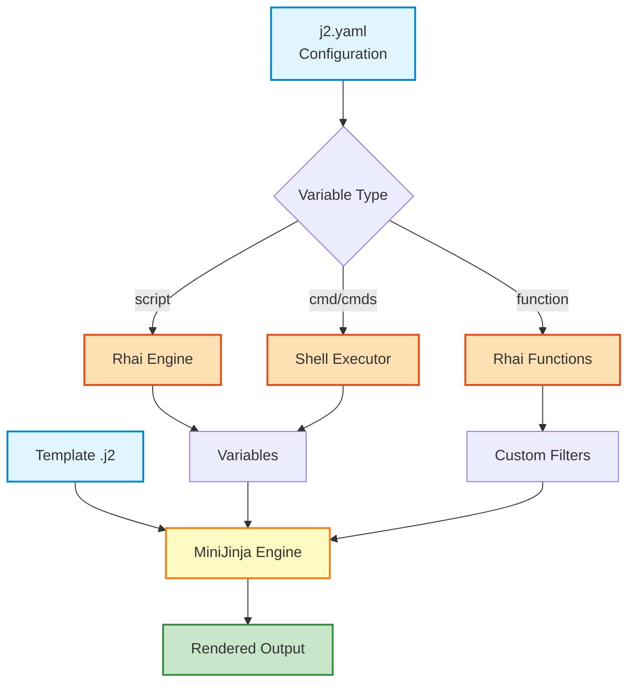

# jinja.rs

> A powerful, configuration-driven template rendering engine combining MiniJinja templates with Rhai scripting and shell command execution.

[](https://www.rust-lang.org/)
[](LICENSE)

## ✨ Features

- 🎨 **MiniJinja Templates** - Full-featured Jinja2-compatible templating
- 🦀 **Rhai Scripting** - Embedded scripting for dynamic variable generation
- 🐚 **Shell Integration** - Execute shell commands and inject results into templates
- ⚙️ **Declarative Configuration** - Define everything in a clean YAML file
- 🎯 **Custom Filters** - Create MiniJinja filters from Rhai functions
- 🔧 **Flexible Execution** - Per-variable shell selection, environment variables, and working directories
- 🚀 **Zero Runtime Dependencies** - Single binary, works anywhere

## 🚀 Quick Start

### Installation

```bash
cargo install jinja-rs
```

Or build from source:

```bash
git clone https://github.com/yonasBSD/jinja.rs
cd jinja.rs
cargo build --release
```

### Basic Usage

1. Create a configuration file `j2.yaml`:

```yaml
default_shell: bash

vars:
  # Script-based variable
  - name: timestamp
    script: "1234567890"
  
  # Shell command variable
  - name: username
    cmd: "whoami"
  
  # Custom filter function
  - function: upper
    arguments:
      - name: text
    script: "text.to_upper()"
```

2. Create a template `template.j2`:

```jinja
Hello {{ username }}!
Timestamp: {{ timestamp }}
Shouting: {{ username | upper }}
```

3. Render the template:

```bash
jinja-rs --template template.j2
```

Output:
```
Hello alice!
Timestamp: 1234567890
Shouting: ALICE
```

## 📖 Documentation

### Configuration File (`j2.yaml`)

The configuration file drives all behavior. It supports:

#### Global Settings

```yaml
default_shell: bash  # Default shell for command execution (optional)
```

#### Variable Types

**1. Rhai Script Variables**

Execute Rhai scripts to generate values:

```yaml
vars:
  - name: calculation
    script: "2 + 2 * 10"
  
  - name: greeting
    script: "\"Hello, \" + \"World!\""
```

**2. Single Command Variables**

Execute a shell command and capture output:

```yaml
vars:
  - name: hostname
    cmd: "hostname"
  
  - name: current_date
    cmd: "date +%Y-%m-%d"
    shell: sh  # Override default shell
```

**3. Multi-Command Variables**

Execute multiple commands and join results:

```yaml
vars:
  - name: system_info
    cmds:
      - "uname -s"
      - "uname -r"
      - "uname -m"
```

**4. Custom Filters**

Define Rhai functions that become MiniJinja filters:

```yaml
vars:
  - function: reverse
    arguments:
      - name: text
    script: |
      let chars = text.split("");
      chars.reverse();
      chars.join("")
  
  - function: multiply
    arguments:
      - name: value
      - name: factor
    script: "parse_int(value) * parse_int(factor)"
```

Use in templates:
```jinja
{{ "hello" | reverse }}
{{ "5" | multiply(3) }}
```

#### Advanced Configuration

**Environment Variables**

```yaml
vars:
  - name: custom_path
    cmd: "echo $MY_VAR"
    env:
      MY_VAR: "/custom/path"
      ANOTHER: "value"
```

**Working Directory**

```yaml
vars:
  - name: files
    cmd: "ls -la"
    cwd: "/tmp"
```

**Shell Selection Precedence**

1. Per-variable `shell` (highest priority)
2. Global `default_shell`
3. `fish` (hardcoded fallback)

```yaml
default_shell: bash

vars:
  - name: uses_bash
    cmd: "echo $SHELL"
  
  - name: uses_sh
    cmd: "echo $SHELL"
    shell: sh  # Overrides default
```

### Template Syntax

jinja.rs uses MiniJinja, which is compatible with Jinja2:

```jinja
{# Comments #}

{{ variable }}  {# Variable substitution #}

{{ variable | filter }}  {# Apply filter #}


  ...



  {{ item }}

```

## 🎯 Use Cases

### Configuration File Generation

Generate Nginx configs, systemd units, or any configuration files:

```yaml
# j2.yaml
vars:
  - name: server_name
    cmd: "hostname -f"
  
  - name: worker_processes
    script: "4"
```

```nginx
# nginx.conf.j2
server {
    server_name {{ server_name }};
    worker_processes {{ worker_processes }};
}
```

### Dynamic Documentation

Create documentation with live system information:

```yaml
vars:
  - name: version
    cmd: "git describe --tags"
  
  - name: build_date
    cmd: "date -u +%Y-%m-%d"
  
  - name: contributors
    cmds:
      - "git log --format='%an' | sort -u | head -5"
```

### DevOps Automation

Generate deployment manifests with environment-specific values:

```yaml
vars:
  - name: environment
    cmd: "echo $DEPLOY_ENV"
  
  - name: replicas
    script: |
      if environment == "prod" { 5 } else { 2 }
```

## 🏗️ Architecture



### Design Principles

1. **Configuration over Code** - All logic defined in YAML, no code changes needed
2. **Separation of Concerns** - Variables, filters, and templates are independent
3. **Composability** - Mix Rhai scripts, shell commands, and template logic freely
4. **Fail-Safe** - Errors are captured and reported, not silently ignored

## 🧪 Testing

Comprehensive test suite with 60+ tests covering:

- Configuration deserialization
- Command execution with various shells
- Rhai script evaluation
- MiniJinja template rendering
- Integration scenarios
- Edge cases and error handling

Run tests:
```bash
cargo test
```

Run tests with output:
```bash
cargo test -- --nocapture
```

See [TESTING.md](TESTING.md) for detailed test documentation.

## 🛣️ Roadmap

- [ ] CLI argument for config file path (currently hardcoded to `j2.yaml`)
- [ ] Template auto-discovery
- [ ] Multi-template rendering in one invocation
- [ ] JSON/TOML config format support
- [ ] Watch mode for live reloading
- [ ] Built-in filter library
- [ ] Plugin system for custom functions
- [ ] Performance optimizations for large-scale rendering

## 🤝 Contributing

Contributions are welcome! Please feel free to submit a Pull Request. For major changes, please open an issue first to discuss what you would like to change.

### Development Setup

```bash
# Clone the repository
git clone https://github.com/yonasBSD/jinja.rs
cd jinja.rs

# Run tests
cargo test

# Run with example
cargo run -- --template examples/demo.j2

# Build release
cargo build --release
```

## 📝 License

This project is licensed under either of:

- Apache License, Version 2.0 ([LICENSE-APACHE](LICENSE-APACHE))
- MIT License ([LICENSE-MIT](LICENSE-MIT))

at your option.

## 🙏 Acknowledgments

- [MiniJinja](https://github.com/mitsuhiko/minijinja) - Jinja2 template engine for Rust
- [Rhai](https://github.com/rhaiscript/rhai) - Embedded scripting language
- [clap](https://github.com/clap-rs/clap) - Command-line argument parsing

## 📧 Contact

- **Author**: yonasBSD
- **Repository**: [github.com/yonasBSD/jinja.rs](https://github.com/yonasBSD/jinja.rs)
- **Issues**: [github.com/yonasBSD/jinja.rs/issues](https://github.com/yonasBSD/jinja.rs/issues)

---

<p align="center">Made with ❤️ and 🦀</p>
